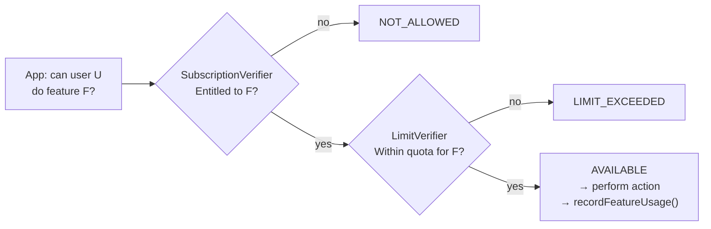
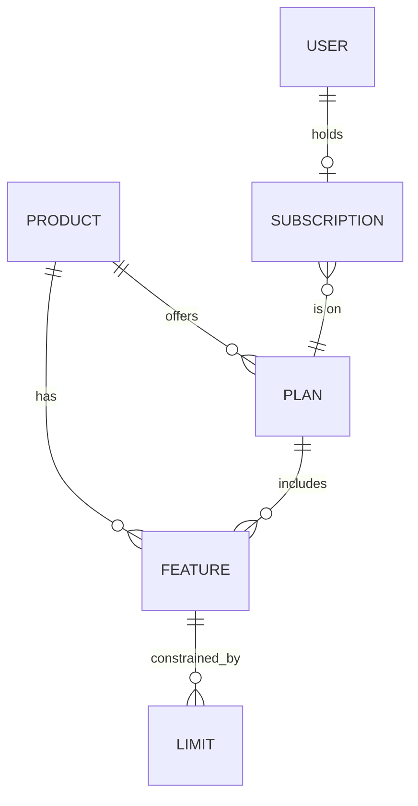
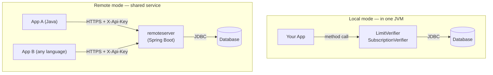

# Pmitz User Guide

## Overview

**Pmitz** is a Java library for controlling user access to application features based on subscriptions and usage limits. It simplifies implementing subscription models and configurable usage quotas in your applications.

- **Recommended Maven Coordinates:** `io.terpomo.pmitz:pmitz-all` — this pulls in `core` + `limits` + `subscriptions`, plus the combined `FeatureUsageTracker` API described below. It's the right starting point for a Local-mode, single-application setup.
- **Version:** 0.9.0
- **Java Version:** 17+
- **License:** Apache 2.0

---

## Introduction

Pmitz answers one question, over and over, cheaply and consistently:

> **"Is this user allowed to do *this* right now?"**

### Two gates: subscription and limit

That question splits into two independent checks, which Pmitz keeps separate on purpose:

| Question | Concept | Answered by |
|---|---|---|
| *Is the user's plan entitled to this feature at all?* | **Subscription** | `SubscriptionVerifier` |
| *Has the user used up their quota for this feature?* | **Limit** | `LimitVerifier` |



A feature is usable only when both answers are yes. Call the two verifiers separately and combine the results yourself (see [Complete Example](#complete-example)), or get both in one call with `FeatureUsageTracker` (see [Feature Status](#feature-status)).

### The data model



| Concept | What it is |
|---|---|
| **Product** | What you sell (e.g. `"Library"`) |
| **Feature** | A capability of a Product (e.g. `"Reserving books"`) |
| **Limit** | A quota rule on a Feature (`CountLimit`, `CalendarPeriodRateLimit`, ...) |
| **Plan** | A subset of a Product's Features, offered to subscribers |
| **Subscription** | A user (or `DirectoryGroup`) on a Plan, with a status and expiration |
| **Usage** | The running per-user, per-Feature record of Limit consumption — written by `recordFeatureUsage`/`reduceFeatureUsage`, read by `getLimitsRemainingUnits` |

Limits and Subscriptions are stored independently, in their own repositories and tables — the two-gate flow above is an application-level convention, not a database constraint.

### Local mode vs. Remote mode

`LimitVerifier` and `SubscriptionVerifier` run **Local** by default: in-process, backed directly by your JDBC `DataSource`. **Remote** mode puts the same logic behind an HTTP API instead, so several applications — including non-Java ones — can share one source of truth:



The remote API mirrors the local one method-for-method (`LimitVerifierRemoteClient` ~ `LimitVerifier`, low-level `PmitzClient` ~ `FeatureUsageTracker`), so switching modes later is a construction-time decision, not a rewrite.

| | **Local** | **Remote** |
|---|---|---|
| What runs | `pmitz-all` (or `core`/`limits`/`subscriptions` individually) in your process | `remoteserver` (standalone or embedded via `spring-boot-starter-remoteserver`) + `remoteclient` in each caller |
| Best for | A single application, or a monolith where the whole product lives in one JVM | Multiple services (or polyglot clients) sharing one view of usage and entitlement |
| Network hop | None | HTTPS, authenticated with `X-Api-Key` |
| Failure mode to handle | `RepositoryException` | `RemoteCallException`, `AuthenticationException` |

**Rule of thumb:** start Local; move to Remote only once more than one process must agree on the same usage counters or subscription state.

The rest of this guide expands on the above in order: **Core Concepts**, **Quick Start**, **Limit**/**Subscription Verification**, **Remote Server**/**Client**, then reference material.

---

## Module Structure

| Module | Purpose |
|--------|---------|
| `core` | Domain models, interfaces, and base abstractions |
| `limits` | Usage limit verification and tracking |
| `subscriptions` | Subscription management and verification |
| `all` | Aggregates core + limits + subscriptions modules |
| `remoteserver` | Standalone Spring Boot REST API server |
| `spring-boot-starter-remoteserver` | Embeddable Spring Boot starter for remote mode |
| `remoteclient` | HTTP client for remote server |
| `examples` | Sample applications |

---

## Core Concepts

### User Types

Pmitz supports different user abstractions through `UserGrouping`:

| Class | Description |
|-------|-------------|
| `IndividualUser` | Single user entity |
| `DirectoryGroup` | Group of users from organization/directory |
| `Subscription` | User with subscription status, expiration, and product-plan mappings |

### Product & Features

```
Product
├── productId
├── features[]
│   ├── featureId
│   └── limits[]
└── plans[]
    ├── planId
    └── includedFeatures[]
```

### Limit Types

| Type | Description | Example |
|------|-------------|---------|
| `CountLimit` | Simple counter limit | Max 5 books reserved |
| `CalendarPeriodRateLimit` | Calendar-aligned rate limit | 100 API calls per month |

### Feature Status

`FeatureStatus` is the combined result of both gates from the [Introduction](#introduction) — subscription entitlement *and* limit usage — in a single value:

| Status | Meaning |
|--------|---------|
| `NOT_ALLOWED` | `SubscriptionVerifier` rejected the feature; limits are not checked |
| `LIMIT_EXCEEDED` | Entitled, but a `LimitVerifier` quota is exhausted |
| `AVAILABLE` | Entitled and within all limits |

You won't see `FeatureStatus` if you call `LimitVerifier` and `SubscriptionVerifier` separately, as in [Limit Verification](#limit-verification) and [Subscription Verification](#subscription-verification) — those expose booleans (`isWithinLimits`, `isFeatureAllowed`), exceptions (`LimitExceededException`), and, for subscription failures specifically, a `SubscriptionVerifDetail` with its own `errorCause` (`INVALID_SUBSCRIPTION`, `PRODUCT_NOT_ALLOWED`, `FEATURE_NOT_ALLOWED`). `FeatureStatus` is what you get back instead when you run both checks through one call:

- **`FeatureUsageTracker`** (`all` module) — build one with `FeatureUsageTracker.Builder.build(limitVerifier, subscriptionVerifier)`, then call `verifyLimits(...)` or `getUsageInfo(...)`; each returns a `FeatureUsageInfo(FeatureStatus, remainingUsageUnits)`.
- **`PmitzClient`** (remote, low-level) — `verifyLimits(...)` returns the same `FeatureUsageInfo`, computed server-side the same way (see [Low-Level Client](#low-level-client)).

Prefer `FeatureUsageTracker` / `PmitzClient.verifyLimits` when you want one call and one status; call `LimitVerifier` / `SubscriptionVerifier` directly when you need their distinct error detail (e.g. to tell a user *why* they were denied).

---

## Quick Start

### 1. Add Dependencies

**Gradle:**
```groovy
implementation 'io.terpomo.pmitz:pmitz-all:0.9.0'
// Or specific modules:
implementation 'io.terpomo.pmitz:pmitz-core:0.9.0'
implementation 'io.terpomo.pmitz:pmitz-limits:0.9.0'
implementation 'io.terpomo.pmitz:pmitz-subscriptions:0.9.0'
```

### 2. Define Your Product (JSON)

```json
{
  "productId": "Library",
  "features": [
    {
      "featureId": "Reserving books",
      "limits": [
        {
          "type": "CountLimit",
          "id": "Maximum books reserved",
          "count": 5
        }
      ]
    },
    {
      "featureId": "API calls",
      "limits": [
        {
          "type": "CalendarPeriodRateLimit",
          "id": "Monthly API quota",
          "quota": 1000,
          "periodicity": "MONTH"
        }
      ]
    }
  ]
}
```

### 3. Load Product Configuration

```java
InMemoryProductRepository productRepo = new InMemoryProductRepository();
productRepo.load(getClass().getResourceAsStream("/product.json"));
```

---

## Limit Verification

### Building a LimitVerifier

```java
// Basic setup with JDBC storage
LimitVerifier limitVerifier = LimitVerifierBuilder.of(productRepo)
    .withDefaultLimitRuleResolver()
    .withJdbcUsageRepository(dataSource, "dbo", "usage")
    .build();

// With user-specific limit overrides
UserLimitRepository userLimitRepo = UserLimitRepository.builder()
    .jdbcRepository(dataSource, "dbo", "user_limit");

LimitVerifier limitVerifier = LimitVerifierBuilder.of(productRepo)
    .withUserLimitRepository(userLimitRepo)
    .withJdbcUsageRepository(dataSource, "dbo", "usage")
    .build();
```

### Checking Limits

```java
Feature feature = productRepo.getProductById("Library")
    .flatMap(p -> p.getFeature("Reserving books"))
    .orElseThrow();

IndividualUser user = new IndividualUser("user123");

// Check if within limits
boolean withinLimits = limitVerifier.isWithinLimits(feature, user, Map.of("Maximum books reserved", 1L));

// Get remaining units
Map<String, Long> remaining = limitVerifier.getLimitsRemainingUnits(feature, user);
```

### Recording Usage

```java
try {
    // Records usage and throws if limit exceeded
    limitVerifier.recordFeatureUsage(feature, user, Map.of("Maximum books reserved", 1L));
} catch (LimitExceededException e) {
    // Handle limit exceeded
}
```

### Reducing Usage (e.g., when user returns a book)

```java
limitVerifier.reduceFeatureUsage(feature, user, Map.of("Maximum books reserved", 1L));
```

---

## Subscription Verification

### Building a SubscriptionVerifier

```java
SubscriptionVerifier subscriptionVerifier = SubscriptionVerifierBuilder
    .withJdbcSubscriptionRepository(dataSource, "dbo", "subscription", "subscription_plan")
    .withDefaultSubscriptionFeatureManager(productRepo)
    .build();
```

### Verifying Entitlement

```java
Subscription subscription = subscriptionRepo.find("subscription-id").orElseThrow();
Feature feature = productRepo.getFeature("productId", "featureId");

SubscriptionVerifDetail detail = subscriptionVerifier.verifyEntitlement(feature, subscription);

if (detail.isAllowed()) {
    // Feature is allowed
} else {
    // Check detail.getErrorCause() for:
    // - INVALID_SUBSCRIPTION
    // - PRODUCT_NOT_ALLOWED
    // - FEATURE_NOT_ALLOWED
}

// Convenience method
boolean allowed = subscriptionVerifier.isFeatureAllowed(feature, subscription);
```

### Subscription Lifecycle

```java
SubscriptionRepository subscriptionRepo = JDBCSubscriptionRepository.create(
    dataSource, "dbo", "subscription", "subscription_plan");

// Create subscription
subscriptionRepo.create(subscription);

// Lifecycle methods
subscriptionRepo.activate(subscriptionId);
subscriptionRepo.cancel(subscriptionId);
subscriptionRepo.terminate(subscriptionId);
```

---

## Remote Server

### Architecture

Remote mode is available in two server-side forms:

- `spring-boot-starter-remoteserver` embeds the remote REST endpoints, API-key security, and JDBC-backed usage and subscription repositories into your own Spring Boot application.
- `remoteserver` packages that starter as the standalone Pmitz server. This is the Docker deployment target documented in [DOCKER.md](DOCKER.md).

### Standalone Deployment

The standalone `remoteserver` module provides a Spring Boot REST API:

```bash
docker run -e SPRING_PROFILES_ACTIVE=postgresql \
           -e PMITZ_API_KEY=your-api-key \
           -e SPRING_DATASOURCE_URL=jdbc:postgresql://host:5432/db \
           -e SPRING_DATASOURCE_USERNAME=user \
           -e SPRING_DATASOURCE_PASSWORD=pass \
           terpomo/pmitz-remoteserver:0.9.0
```

### API Endpoints

| Method | Endpoint | Description |
|--------|----------|-------------|
| POST | `/products` | Add product configuration |
| DELETE | `/products/{productId}` | Remove product |
| GET | `/users/{userId}/usage/{productId}/{featureId}` | Get remaining units |
| POST | `/users/{userId}/usage/{productId}/{featureId}` | Record usage |
| POST | `/users/{userId}/limits-check/{productId}/{featureId}` | Check whether usage would remain within limits |
| GET | `/users/{userId}/subscription-check/{productId}/{featureId}` | Check subscription entitlement |
| GET | `/directory-groups/{groupId}/usage/...` | Group usage queries |
| POST | `/directory-groups/{groupId}/usage/...` | Record group usage |
| POST | `/subscriptions` | Create a subscription |
| GET | `/subscriptions/{subscriptionId}` | Load a subscription |
| PATCH | `/subscriptions/{subscriptionId}/status` | Update subscription status |

### Authentication

All requests require the `X-Api-Key` header matching the configured `PMITZ_API_KEY`. API-key security is the
currently supported remote-server security mode.

### Remote Server Properties

Default repository objects are stored in the `dbo` schema with these table names:

- `usage`
- `user_limit`
- `subscription`
- `subscription_plan`

Override them with Spring configuration properties if needed:

```properties
pmitz.remoteserver.repository.rdb.schema-name=dbo
pmitz.remoteserver.repository.rdb.user-usage-table-name=usage
pmitz.remoteserver.repository.rdb.user-limit-table-name=user_limit
pmitz.remoteserver.repository.rdb.subscription-table-name=subscription
pmitz.remoteserver.repository.rdb.subscription-plan-table-name=subscription_plan
```

---

## Remote Client

### Using LimitVerifierRemoteClient

```java
// PMITZ_API_KEY or -Dpmitz.api.key must be set before creating the client.
LimitVerifierRemoteClient remoteVerifier = new LimitVerifierRemoteClient("http://localhost:8080");

// Upload product definition
remoteVerifier.uploadProduct(productJsonInputStream);

// Use same API as local LimitVerifier
try {
    remoteVerifier.recordFeatureUsage(feature, user, units);
} catch (RemoteCallException e) {
    // Handle network/server errors
}

// Get remaining units
Map<String, Long> remaining = remoteVerifier.getLimitsRemainingUnits(feature, user);
```

### Low-Level Client

```java
System.setProperty("pmitz.api.key", "your-api-key");

PmitzClient client = new PmitzHttpClient(
    "http://localhost:8080",
    new PmitzApiKeyAuthenticationProvider());

FeatureUsageInfo info = client.verifyLimits(
    new FeatureRef("Library", "Reserving books"),
    new IndividualUser("user123"),
    Map.of("Maximum books reserved", 1L));
```

---

## Database Setup

### Supported Databases

- PostgreSQL (recommended for production)
- MySQL
- SQL Server
- H2 (for testing/development)

### Required Tables

**Usage tracking (`dbo.usage`):**
```sql
CREATE TABLE dbo.usage (
    -- Schema varies by database, see /resources/scripts/repos/sql/
);
```

**User limit overrides (`dbo.user_limit`):**
```sql
CREATE TABLE dbo.user_limit (
    -- Schema varies by database
);
```

**Subscriptions (`dbo.subscription`, `dbo.subscription_plan`):**
```sql
CREATE TABLE dbo.subscription (...);
CREATE TABLE dbo.subscription_plan (...);
```

SQL scripts for each database are available in the module resources under `/scripts/repos/sql/`.

---

## Setting User-Specific Limits

Override default limits for specific users:

```java
UserLimitRepository userLimitRepo = UserLimitRepository.builder()
    .jdbcRepository(dataSource, "dbo", "user_limit");

// Give premium user higher limit
CountLimit premiumLimit = new CountLimit("Maximum books reserved", 20);
userLimitRepo.updateLimitRule(feature, premiumLimit, premiumUser);
```

---

## Exception Handling

| Exception | When Thrown |
|-----------|-------------|
| `LimitExceededException` | Usage recording exceeds limit |
| `FeatureNotAllowedException` | User not entitled to feature |
| `FeatureNotFoundException` | Feature doesn't exist |
| `ConfigurationException` | Configuration problem |
| `RepositoryException` | Database access error |
| `RemoteCallException` | Network/remote server error |
| `AuthenticationException` | API authentication failure |

---

## Complete Example

```java
public class LibrarySystem {

    private final LimitVerifier limitVerifier;
    private final SubscriptionVerifier subscriptionVerifier;
    private final ProductRepository productRepo;

    public LibrarySystem(DataSource dataSource) {
        // Load product configuration
        this.productRepo = new InMemoryProductRepository();
        productRepo.load(getClass().getResourceAsStream("/library-product.json"));

        // Build limit verifier
        this.limitVerifier = LimitVerifierBuilder.of(productRepo)
            .withDefaultLimitRuleResolver()
            .withJdbcUsageRepository(dataSource, "library", "usage")
            .build();

        // Build subscription verifier
        this.subscriptionVerifier = SubscriptionVerifierBuilder
            .withJdbcSubscriptionRepository(dataSource, "library", "subscription", "subscription_plan")
            .withDefaultSubscriptionFeatureManager(productRepo)
            .build();
    }

    public void reserveBook(String userId, String bookId) {
        IndividualUser user = new IndividualUser(userId);
        Feature reservingBooks = productRepo.getFeature("Library", "Reserving books");

        // Check subscription entitlement
        Subscription userSub = getUserSubscription(userId);
        if (!subscriptionVerifier.isFeatureAllowed(reservingBooks, userSub)) {
            throw new RuntimeException("Feature not allowed for your subscription");
        }

        // Record usage (throws if limit exceeded)
        limitVerifier.recordFeatureUsage(reservingBooks, user,
            Map.of("Maximum books reserved", 1L));

        // Proceed with reservation...
    }

    public void returnBook(String userId, String bookId) {
        IndividualUser user = new IndividualUser(userId);
        Feature reservingBooks = productRepo.getFeature("Library", "Reserving books");

        // Reduce usage count
        limitVerifier.reduceFeatureUsage(reservingBooks, user,
            Map.of("Maximum books reserved", 1L));

        // Proceed with return...
    }

    public int getRemainingReservations(String userId) {
        IndividualUser user = new IndividualUser(userId);
        Feature reservingBooks = productRepo.getFeature("Library", "Reserving books");

        Map<String, Long> remaining = limitVerifier.getLimitsRemainingUnits(reservingBooks, user);
        return remaining.get("Maximum books reserved").intValue();
    }
}
```

---

## Builder Reference

### LimitVerifierBuilder

```java
LimitVerifierBuilder.of(productRepository)
    // Limit resolution (pick one):
    .withDefaultLimitRuleResolver()           // Use default limits from product
    .withUserLimitRepository(userLimitRepo)   // Support user-specific overrides
    .withCustomLimitRuleResolver(resolver)    // Custom resolver

    // Usage storage (pick one):
    .withJdbcUsageRepository(dataSource, schema, table)
    .withCustomUsageRepository(usageRepo)

    // Optional:
    .withUserLimitVerificationStrategy(strategy)  // Custom verification logic

    .build();
```

### SubscriptionVerifierBuilder

```java
SubscriptionVerifierBuilder
    // Subscription repository (pick one):
    .withSubscriptionRepository(subscriptionRepo)
    .withJdbcSubscriptionRepository(ds, schema, subTable, planTable)

    // Feature manager (pick one):
    .withDefaultSubscriptionFeatureManager(productRepo)
    .withSubscriptionFeatureManager(customManager)

    .build();
```

---

## Additional Resources

- [README.md](README.md) - Project overview and quick start
- [DOCKER.md](DOCKER.md) - Docker deployment instructions
- [CONTRIBUTING.md](CONTRIBUTING.md) - Contribution guidelines
- [CODE_STYLE.md](CODE_STYLE.md) - Code style guidelines
- [Examples module](examples/) - Sample applications with working code
