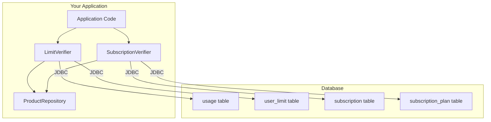
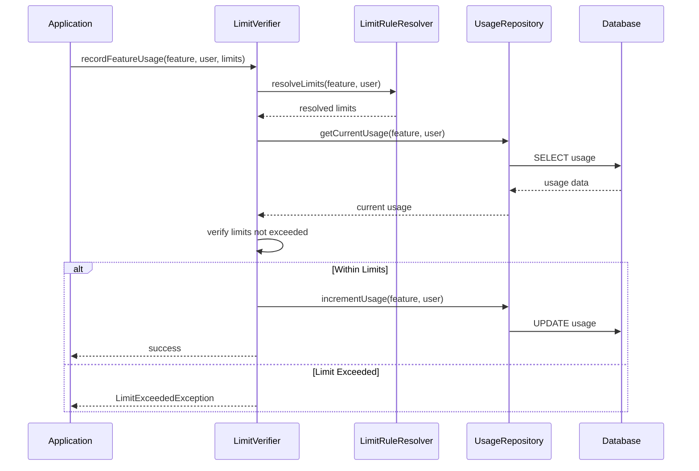
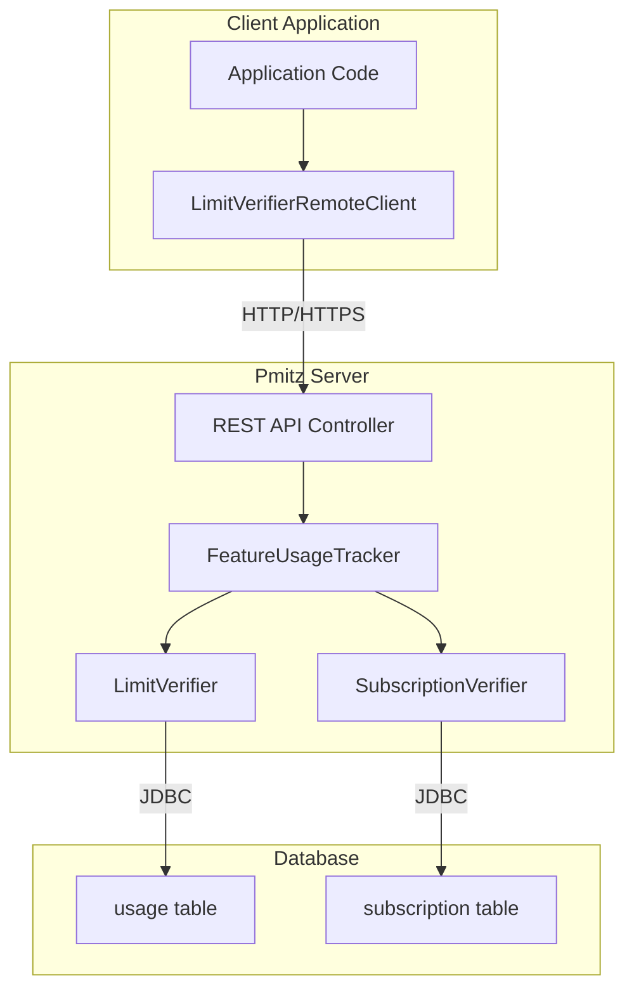
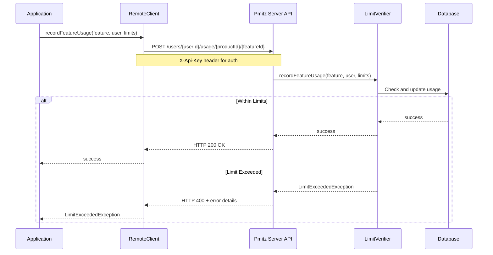
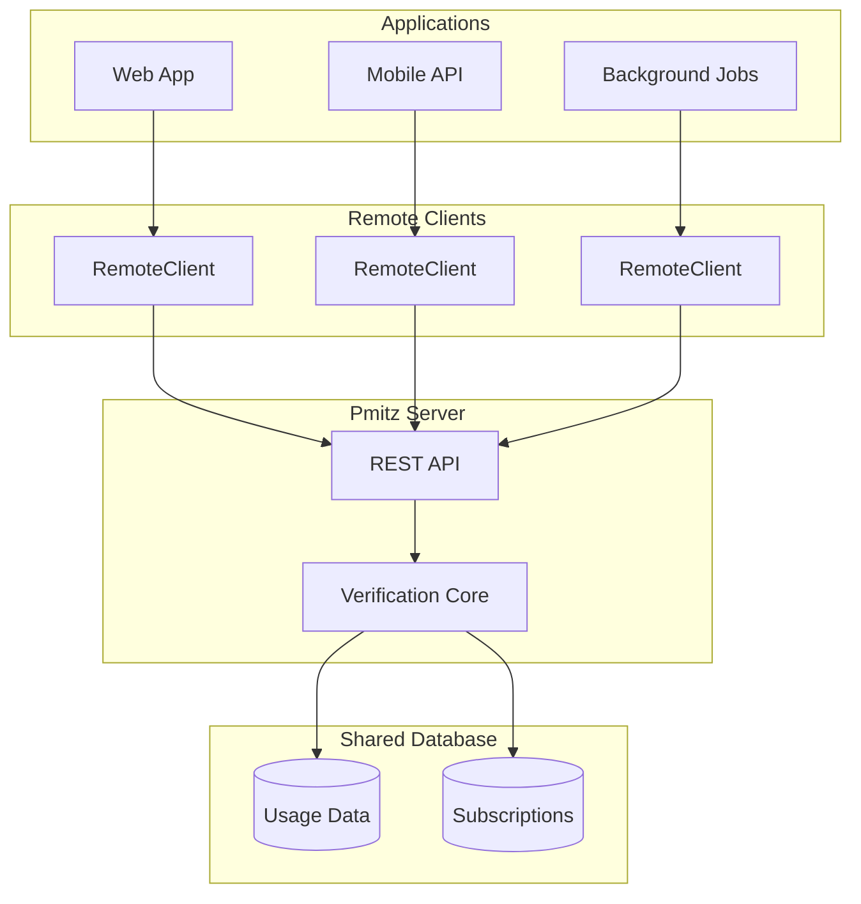
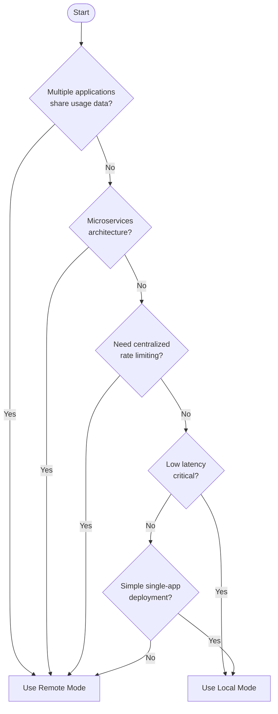

# Local vs Remote Modes

Pmitz supports two operational modes for subscription and limit verification: **Local Mode** and **Remote Mode**. This document explains the differences, use cases, and architecture of each approach.

## Overview

| Aspect | Local Mode | Remote Mode |
|--------|-----------|-------------|
| **Deployment** | Embedded in application | Centralized Spring Boot server |
| **Database Access** | Direct JDBC connection | Server manages database |
| **Network** | None (in-process) | HTTP/HTTPS required |
| **Latency** | Minimal (same JVM) | Network dependent |
| **Scalability** | Per-application instance | Shared across applications |
| **Best For** | Monolithic apps, single instance | Microservices, multi-tenant |

## Local Mode

In Local Mode, verification runs directly within your application process using JDBC database connections.

### Architecture



### Verification Flow



### Configuration

```java
// Load product definitions
ProductRepository productRepo = new InMemoryProductRepository();
productRepo.load(getClass().getResourceAsStream("/products.json"));

// Build LimitVerifier with local database
LimitVerifier limitVerifier = LimitVerifierBuilder.of(productRepo)
    .withDefaultLimitRuleResolver()
    .withJdbcUsageRepository(dataSource, "dbo", "usage")
    .build();

// Build SubscriptionVerifier with local database
SubscriptionVerifier subscriptionVerifier = SubscriptionVerifierBuilder
    .withJdbcSubscriptionRepository(dataSource, "dbo", "subscription", "subscription_plan")
    .withDefaultSubscriptionFeatureManager(productRepo)
    .build();
```

### When to Use Local Mode

- Single application instance
- Monolithic architecture
- Low latency requirements
- Application already has database access
- Simple deployment without additional services

## Remote Mode

In Remote Mode, verification is delegated to a centralized Pmitz server via HTTP/HTTPS REST API.

### Architecture



### Verification Flow



### Configuration

**Client Side:**

```java
// Create remote client pointing to Pmitz server
LimitVerifier limitVerifier = new LimitVerifierRemoteClient("http://localhost:8080");

// Upload product definitions to server
limitVerifier.uploadProduct(getClass().getResourceAsStream("/products.json"));
```

**Server Side (Environment Variables):**

```bash
# Database configuration
SPRING_DATASOURCE_URL=jdbc:postgresql://localhost:5432/pmitz
SPRING_DATASOURCE_USERNAME=pmitz
SPRING_DATASOURCE_PASSWORD=secret

# API authentication
PMITZ_API_KEY=your-api-key
```

### REST API Endpoints

| Method | Endpoint | Description |
|--------|----------|-------------|
| `GET` | `/{userGroupingType}/{id}/usage/{productId}/{featureId}` | Get current usage |
| `POST` | `/{userGroupingType}/{id}/usage/{productId}/{featureId}` | Record usage |
| `POST` | `/{userGroupingType}/{id}/limits-check/{productId}/{featureId}` | Check if within limits |
| `POST` | `/products` | Upload product definition |
| `DELETE` | `/products/{productId}` | Remove product |

**User Grouping Types:**
- `users` - Individual users
- `subscriptions` - Subscription-based grouping
- `directory-groups` - Directory/team groups

### When to Use Remote Mode

- Microservices architecture
- Multiple applications sharing usage data
- Centralized usage tracking across services
- Multi-tenant SaaS applications
- Need for shared rate limiting

## Multi-Application Architecture (Remote Mode)



## Choosing Between Modes



## Code Example Comparison

Both modes implement the same `LimitVerifier` interface, making them interchangeable:

```java
// Same usage code works with both modes
Feature feature = productRepo.getFeature("Library", "Reserving books");
UserGrouping user = new IndividualUser("user123");

// Record usage
limitVerifier.recordFeatureUsage(feature, user, Map.of("Maximum books reserved", 5L));

// Check remaining quota
Map<String, Long> remaining = limitVerifier.getLimitsRemainingUnits(feature, user);

// Check if within limits (without recording)
boolean withinLimits = limitVerifier.isWithinLimits(feature, user, Map.of("Maximum books reserved", 1L));
```

## Database Requirements

Both modes require the same database schema:

| Table | Purpose |
|-------|---------|
| `usage` | Tracks usage counts per user/feature/limit |
| `user_limit` | Per-user limit overrides (optional) |
| `subscription` | Subscription records |
| `subscription_plan` | Maps subscriptions to product plans |

**Supported Databases:** PostgreSQL, MySQL, SQL Server, H2 (dev/test)
