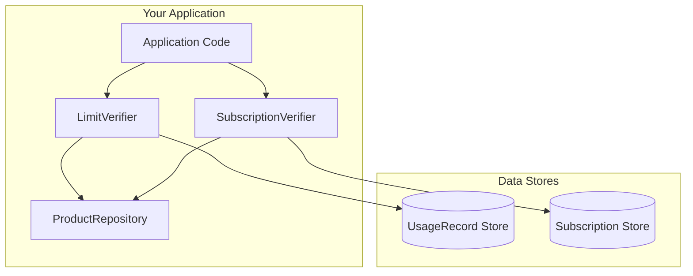
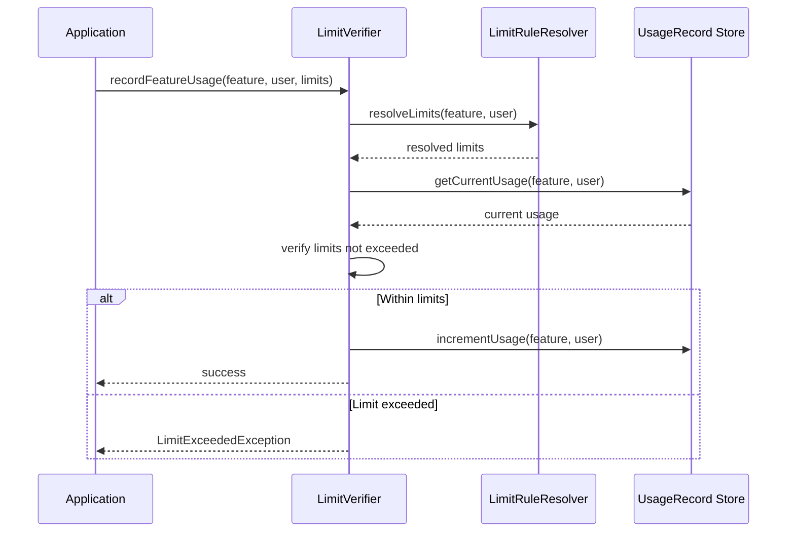
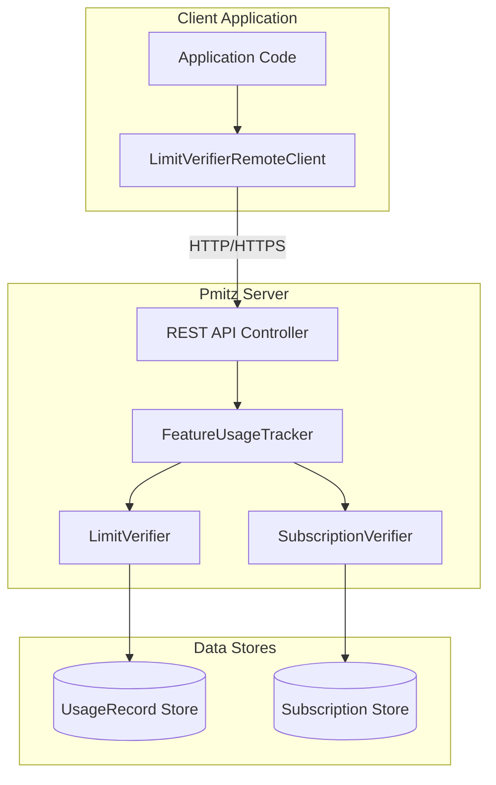
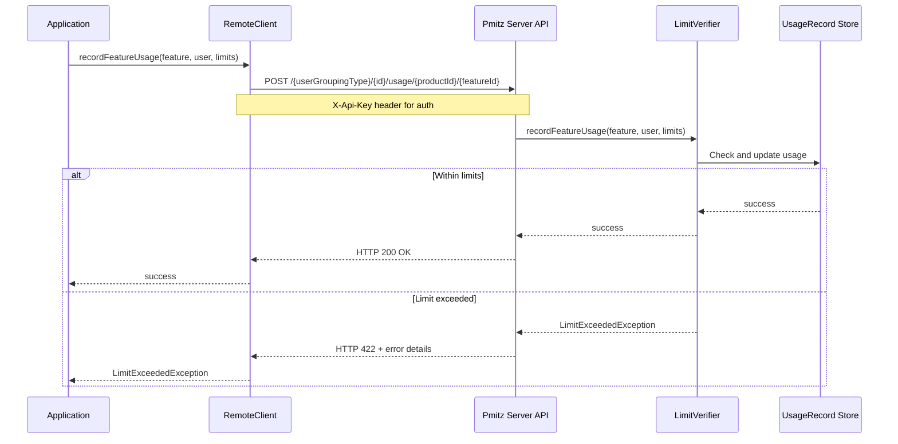

# Local vs Remote Modes

This is the architecture deep-dive behind the [Local mode vs. Remote mode](../USERGUIDE.md#local-mode-vs-remote-mode) section of the [User Guide](../USERGUIDE.md) — start there for the concepts (the subscription/limit two-gate check, the data model) this page assumes. This page shows what each mode looks like internally.

## Overview

| Aspect | Local Mode | Remote Mode |
|--------|-----------|-------------|
| **Deployment** | Embedded in your application | Centralized `remoteserver`, standalone or starter-embedded |
| **Data access** | Your app talks to the stores directly | Server owns the stores on your app's behalf |
| **Network** | None (in-process) | HTTP/HTTPS |
| **Best for** | A single application or monolith | Multiple applications sharing usage and entitlement data |

Pmitz persists through two stores: the **UsageRecord Store** (limit consumption) and the **Subscription Store** (entitlement state). They're independent — neither mode requires them to be the same database, or even the same kind of store.

## Local Mode

Verification runs in-process, reading and writing the stores directly.

```mermaid
flowchart TB
    subgraph Application["Your Application"]
        App[Application Code]
        LV[LimitVerifier]
        SV[SubscriptionVerifier]
        PR[ProductRepository]
    end

    subgraph Stores["Data Stores"]
        US[("UsageRecord Store")]
        SS[("Subscription Store")]
    end

    App --> LV
    App --> SV
    LV --> PR
    SV --> PR
    LV --> US
    SV --> SS
```

```mermaid
sequenceDiagram
    participant App as Application
    participant LV as LimitVerifier
    participant LRR as LimitRuleResolver
    participant US as UsageRecord Store

    App->>LV: recordFeatureUsage(feature, user, limits)
    LV->>LRR: resolveLimits(feature, user)
    LRR-->>LV: resolved limits
    LV->>US: getCurrentUsage(feature, user)
    US-->>LV: current usage
    LV->>LV: verify limits not exceeded
    alt Within limits
        LV->>US: incrementUsage(feature, user)
        LV-->>App: success
    else Limit exceeded
        LV-->>App: LimitExceededException
    end
```

Setup code: [Quick Start](../USERGUIDE.md#quick-start), [Limit Verification](../USERGUIDE.md#limit-verification), [Subscription Verification](../USERGUIDE.md#subscription-verification).

## Remote Mode

Verification is delegated over HTTP/HTTPS to a centralized Pmitz server (`remoteserver`, or an app embedding `spring-boot-starter-remoteserver`).

```mermaid
flowchart TB
    subgraph ClientApp["Client Application"]
        App[Application Code]
        RC[LimitVerifierRemoteClient]
    end

    subgraph PmitzServer["Pmitz Server"]
        API[REST API Controller]
        FUT[FeatureUsageTracker]
        LV[LimitVerifier]
        SV[SubscriptionVerifier]
    end

    subgraph Stores["Data Stores"]
        US[("UsageRecord Store")]
        SS[("Subscription Store")]
    end

    App --> RC
    RC -->|HTTP/HTTPS| API
    API --> FUT
    FUT --> LV
    FUT --> SV
    LV --> US
    SV --> SS
```

```mermaid
sequenceDiagram
    participant App as Application
    participant RC as RemoteClient
    participant API as Pmitz Server API
    participant LV as LimitVerifier
    participant US as UsageRecord Store

    App->>RC: recordFeatureUsage(feature, user, limits)
    RC->>API: POST /{userGroupingType}/{id}/usage/{productId}/{featureId}
    Note over RC,API: X-Api-Key header for auth
    API->>LV: recordFeatureUsage(feature, user, limits)
    LV->>US: Check and update usage
    alt Within limits
        US-->>LV: success
        LV-->>API: success
        API-->>RC: HTTP 200 OK
        RC-->>App: success
    else Limit exceeded
        LV-->>API: LimitExceededException
        API-->>RC: HTTP 422 + error details
        RC-->>App: LimitExceededException
    end
```

Endpoints, authentication, server configuration, and client code: [Remote Server](../USERGUIDE.md#remote-server), [Remote Client](../USERGUIDE.md#remote-client).

## Choosing Between Modes

Use the **Best for** row in the [Overview](#overview) table above as a quick check. **Rule of thumb:** start Local; move to Remote only once more than one process needs to agree on the same usage counters or subscription state.

Both modes implement the same `LimitVerifier` / `SubscriptionVerifier` contracts and read and write the same UsageRecord Store and Subscription Store ([Database Setup](../USERGUIDE.md#database-setup) covers the supported store backends), so switching later is a construction-time decision, not a rewrite.
